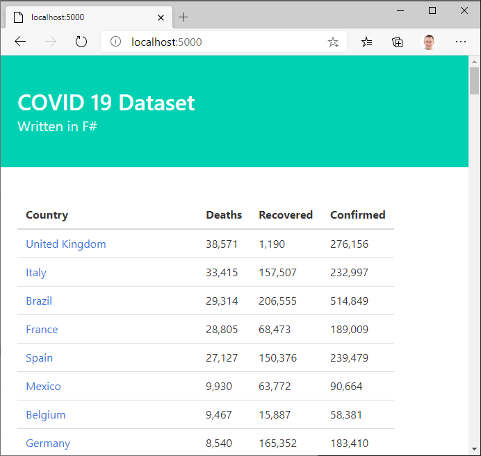
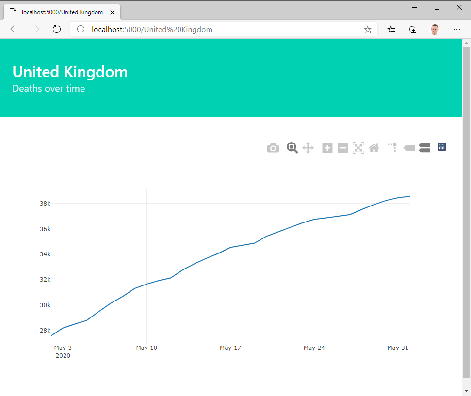

# Rapid Data Analysis in F#

This is a transcript of the excellent F# [Saturn](https://saturnframework.org/)/[Giraffe](https://giraffe.wiki/) code sample on [YouTube](https://www.youtube.com/playlist?list=PLlzAi3ycg2x0_7KdzjwsR-6b6yuRQ8wBS)
by [Isaac Abraham](https://github.com/isaacabraham)
of [Compositional IT](https://www.compositional-it.com/).

The F# [CsvProvider](https://fsharp.github.io/FSharp.Data/library/CsvProvider.html) relies on the [COVID-19](https://github.com/CSSEGISandData/COVID-19) repository
being cloned so it's top level directory is at the same level as the top level directory for this repository.
It also only uses the [.csv files from May 2020](https://github.com/CSSEGISandData/COVID-19/tree/master/csse_covid_19_data/csse_covid_19_daily_reports)
since there are parsing errors from other months.

